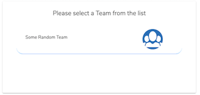
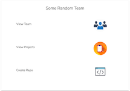
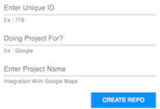

## BITBUCKET - AUTOMATED NEW REPO PROCESS


<div align="center">

[](https://https://reactjs.org/)
[](https://discord.gg/5mwNujH)
[](./LICENSE)
[](https://github.com/seanjin17/Bitbucket-Automated-New-Repository-Process/pulls)


<h6>Suppose your team is handling n number of projects and new projects keep on coming everyday <br><br>
You need to create a new Repository everytime for each project and additionally configure it everytime?  <br><br>
You will create Repo branches? A branching model? Branch Restrictions? Add Reviewers? Enable and configure pipelines? Setup Issue Tracker? SSH keys? and many more process can be there which youll have to go through everyday in order to have a new repo. Well, You don't need to waste those 10 minutes on creating and configuring a new repository anymore. This project solves the problem</h6>
</div>

------------------------------------------
### Prerequisites
[NodeJS](https://nodejs.org/en)

## Installation
`git clone https://github.com/seanjin17/automated-bitbucket-repo-intial-configuration.git`

`cd automated-bitbucket-repo-intial-configuration && npm install`

`npm start`

------------------------------------------
## Usage


```
1. Go to https://bitbucket.org/ > Login > Bitbucket Settings > OAuth and select Add Consumer
2. Fill the basic details and Enter callback URL as the URL where you will host this project
3. Set the permissions according to your need
	Note: You need to provide permissions according to your requirement

After you create a consumer you'll find the Key and Secret for your consumer.
You need to configure the same under your environment variables. See example.env

File src/data-access/config.js contains your basic config for the application to run
You can also assign default reviewers and SSH hosts under src/data-access/config.js file

You can use this URL in order to authenticate users into your app

https://bitbucket.org/site/oauth2/authorize?client_id={key}&response_type=code
	- Dont forget to replace {key} with the actual key provided by bitbucket while 
	  creating the consumer

Please Note : Only response_type code is supported as of now

```

**While creating a repo 3 things are required as input from user:**

```
1. Enter Unique - Unique ID which will be merged after Repository name 
	(So that you are able to create multiple repo under same name)
1. Doing Project For - This will be the name of the project the Repository will be asigned to
2. Enter Project Name - This is the Name of the repository that will be created
```

### Images




### Contributing

 * This project is open to `enhancements` & `bug-fixes` :smile:.
 * Feel free to add issues and submit patches

------------------------------------------
### Author
Anand - [GIT](https://github.com/seanjin17) - [Website](https://my.anandks.com) - [Discord](https://discord.gg/5mwNujH)

------------------------------------------
### License
This project is licensed under the GNU - see the [LICENSE](./LICENSE) file for details

